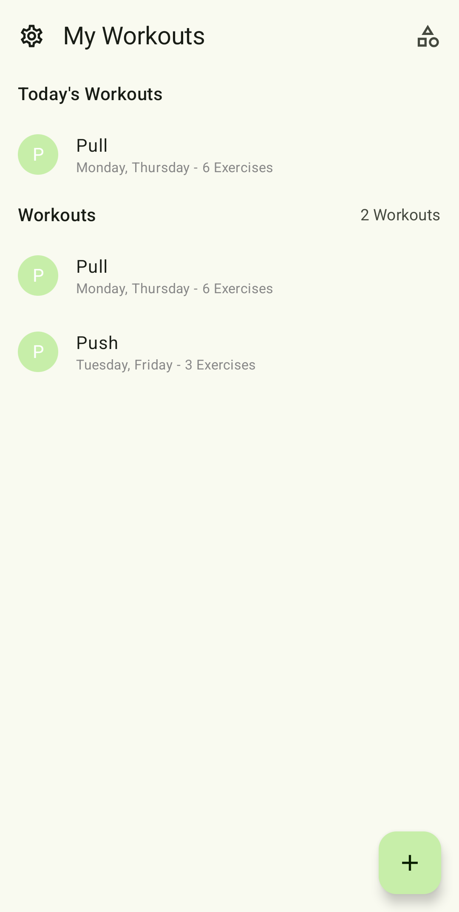
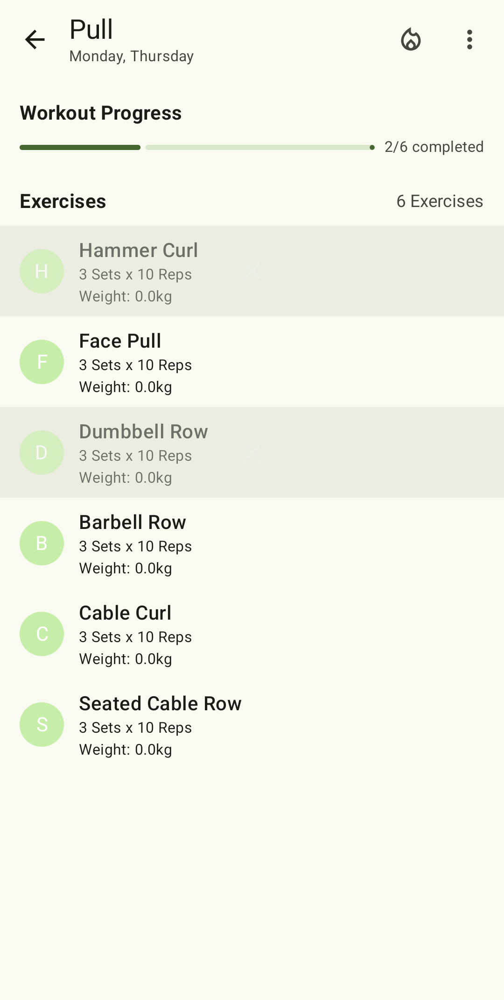
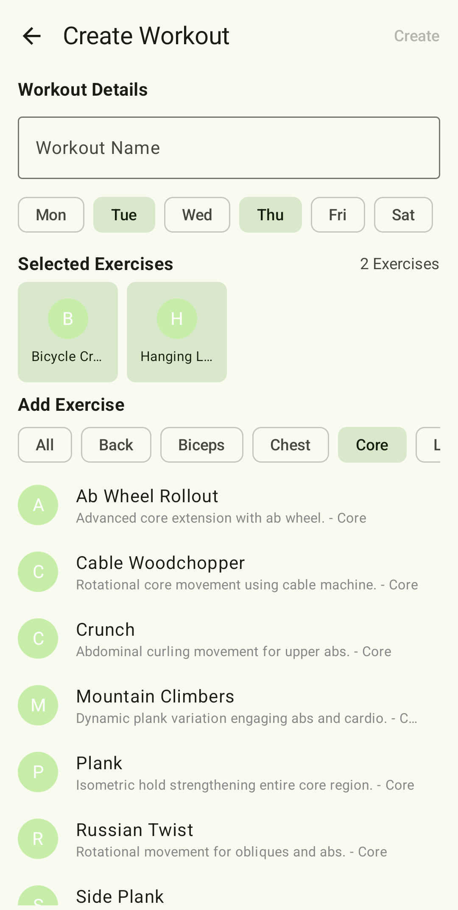
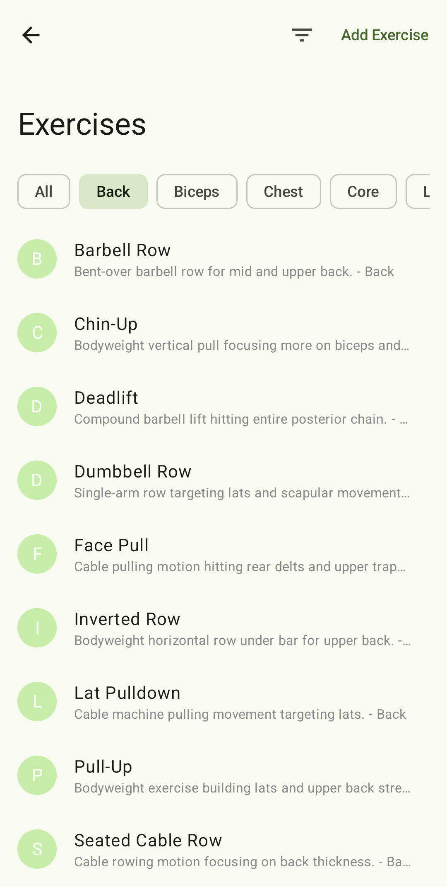
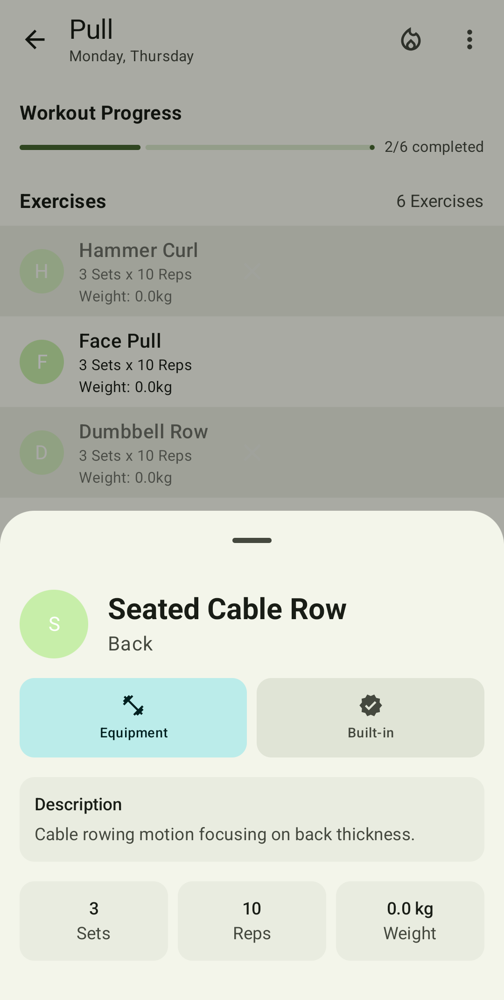

# CoreX Android App

An Android app built using **Kotlin** and **Jetpack Compose** — Android's modern toolkit for
building native UIs. This app demonstrates best practices with a clean architecture, modern
libraries, and Compose UI components.

## Screenshots

<div align="center">





</div>

## Features

- Jetpack Compose UI
- Material3 Components
- MVVM Architecture
- Dependency Injection (Hilt)
- Room database integration
- Dark & Light theme support
- Jetpack Navigation

## Tech Stack

- **Language**: Kotlin
- **UI**: Jetpack Compose
- **Architecture**: MVVM (Model-View-ViewModel)
- **DI**: Hilt
- **Database**: Room
- **Async**: Kotlin Coroutines
- **Navigation**: Jetpack Navigation Compose

## Project Structure

```
at.mcbabo.corex/
├── data                # Data layer
│     ├── dao
│     ├── datastore
│     ├── entities
│     ├── models
│     ├── repositories
│     └── viewmodels
├── di                  # Dagger / Hilt
├── navigation          # Navigation components
├── ui                  # UI layer
│     ├── components
│     ├── motion
│     ├── screens
│     └── theme
├── util                # Utility classes and extensions
└── MainActivity.kt     # Entry point
```

## Testing

- No testing yet lol

## Requirements

- Kotlin 2.20.0
- Gradle 8.0+
- Minimum SDK 33

## ▶Getting Started

1. **Clone the repository**
    ```bash
    git clone https://github.com/mcbabo/CoreX.git
    ```

2. **Open in Android Studio**

3. **Build and run**

> Make sure to sync Gradle and have an emulator or device ready.

## Libraries Used

| Library         | Purpose                    |
|-----------------|----------------------------|
| Jetpack Compose | UI toolkit                 |
| Hilt            | Dependency Injection       |
| Room            | Local database             |
| Coroutines      | Asynchronous programming   |
| Navigation      | Jetpack Navigation Compose |

## Author

**mcbabo**  
[GitHub](https://github.com/mcbabo)

## Credits

Huge shoutout to the [Seal](https://github.com/seal) team!

The app is mostly inspired by [Seal](https://github.com/seal) and other Material 3 apps

## License

This project is licensed under the MIT License - see the [LICENSE](LICENSE) file for details.
