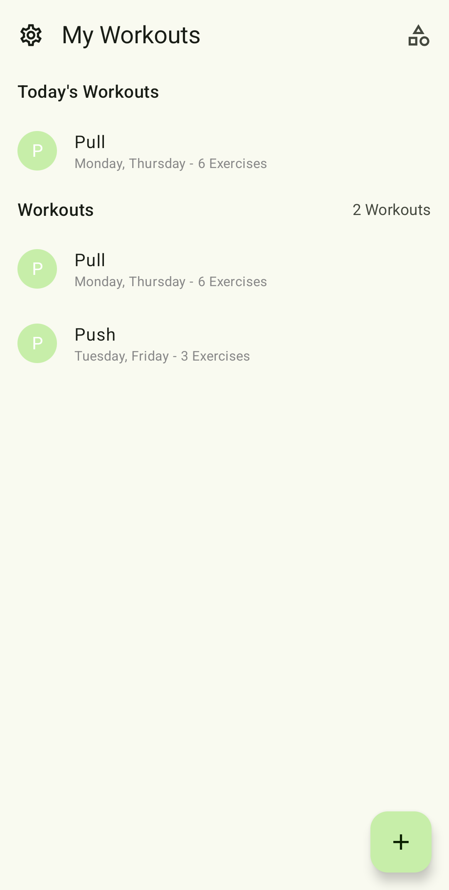
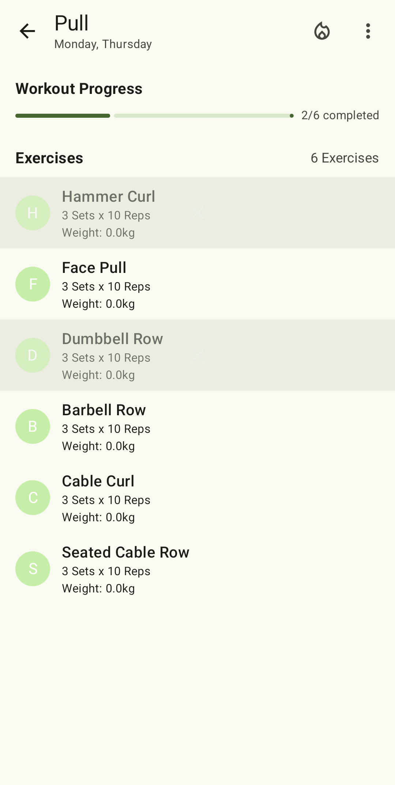
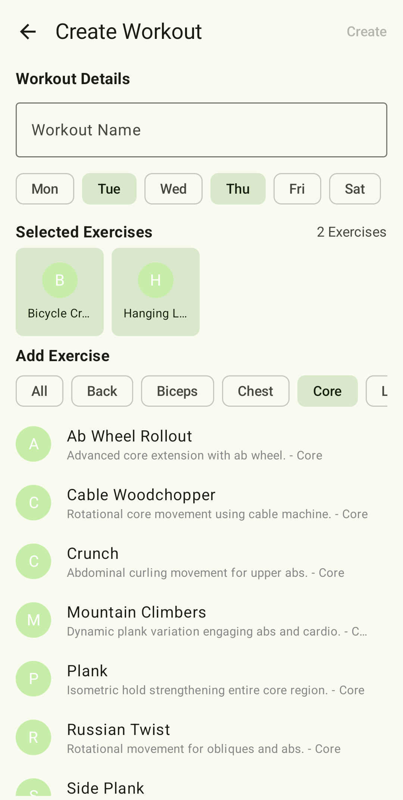
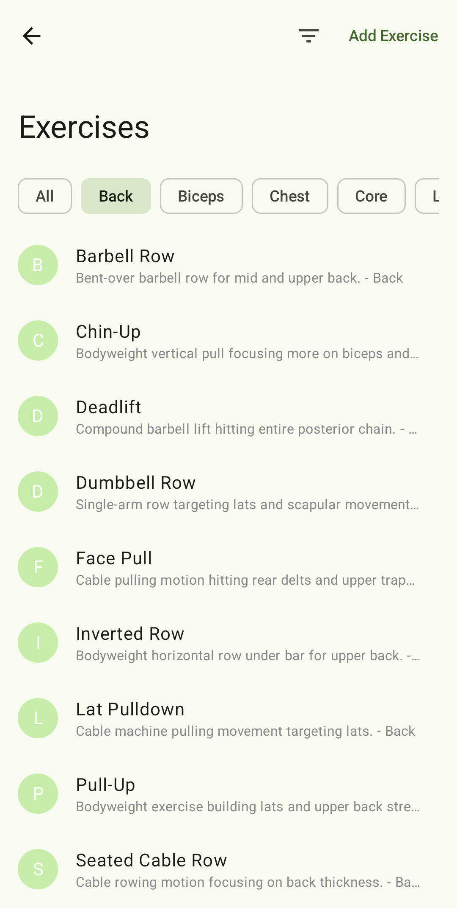
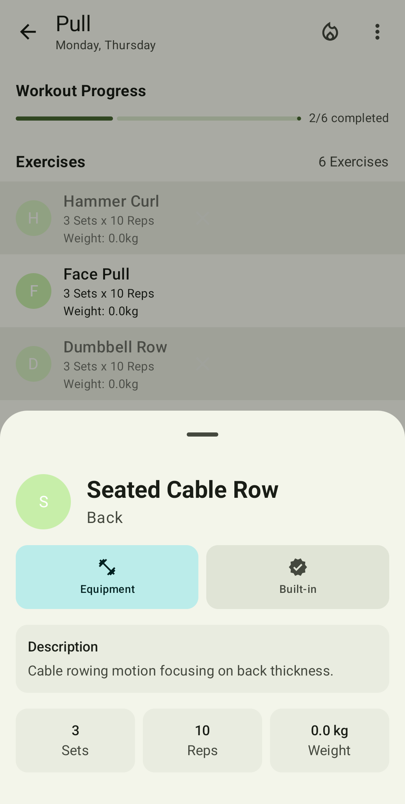

# CoreX

Modern Workout App for tracking workouts, exercises and weight progression.

Built using **Kotlin** and **Jetpack Compose** — Android's modern toolkit for
building native UIs. This app demonstrates best practices with a clean architecture, modern
libraries, and Compose UI components.

## Screenshots

<div align="center">





</div>

## Features

- Workouts
- Custom exercises
- Weight-Progression
- Push-Notification of today's workout
- Dynamic theming

## Download

- Download the latest APK from the [Releases](https://github.com/mcbabo/CoreX/releases/latest) page.

## Contributing

Contributions are welcome!

> For submitting bug reports, feature requests, questions, or any other ideas to improve, please
> read [CONTRIBUTING.md](https://github.com/JunkFood02/Seal/blob/main/CONTRIBUTING.md) for instructions and guidelines
> first.

## Star History

<a href="https://www.star-history.com/#mcbabo/CoreX&Timeline">
 <picture>
   <source media="(prefers-color-scheme: dark)" srcset="https://api.star-history.com/svg?repos=mcbabo/CoreX&type=Timeline&theme=dark" />
   <source media="(prefers-color-scheme: light)" srcset="https://api.star-history.com/svg?repos=mcbabo/CoreX&type=Timeline" />
   
 </picture>
</a>

## Project Structure

```
at.mcbabo.corex/
├── data                # Data layer
│     ├── dao
│     ├── datastore
│     ├── entities
│     ├── models
│     ├── repositories
│     └── viewmodels
├── di                  # Dagger / Hilt
├── navigation          # Navigation components
├── ui                  # UI layer
│     ├── components
│     ├── motion
│     ├── screens
│     └── theme
├── util                # Utility classes and extensions
└── MainActivity.kt     # Entry point
```

## Author

**mcbabo**  
[GitHub](https://github.com/mcbabo)

## Credits

Huge shoutout to the [Seal](https://github.com/seal) team!

The app is mostly inspired by [Seal](https://github.com/seal) and other Material 3 apps

## License

This project is licensed under the MIT License - see the [LICENSE](LICENSE) file for details.
